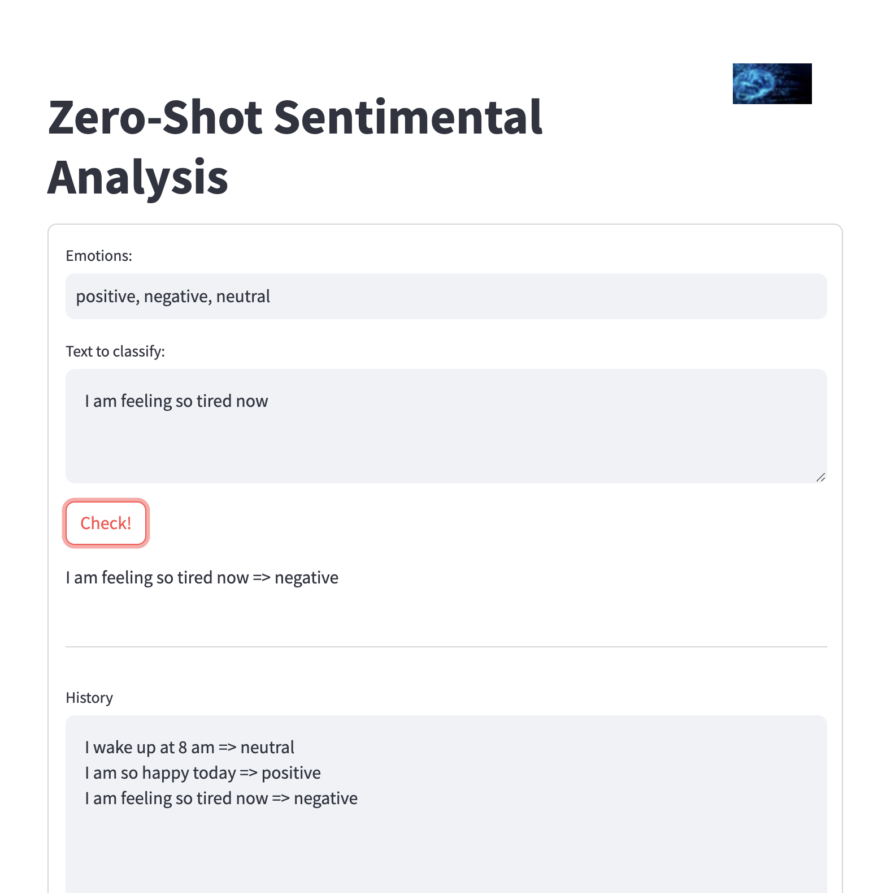

# Zero Shot Sentimental Analysis
The projecty is based on an Emotional Detector app creted with Streamlit and connnected with OpenAI API.
The app will check the emotion in the user prompts and will classify them into different emotions. The emotions are selected by the user.

## To run the app
- Dowload the code
- Execute `streamlit run isentimental_analysis.py`

## To check the app
- By default the app is configured to analyze the sentences into 3 values: positive, negative and neutral. The classification values can be changed by the user
- When the prompt is genereate and want to be checked the the AI model will classify it into the values set in the previus section
- All the emotions classified will be stored in history section

